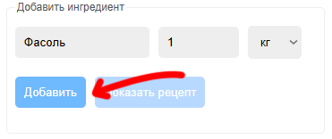
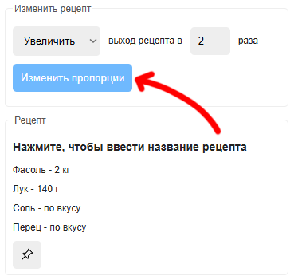
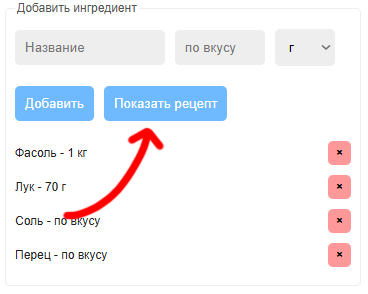
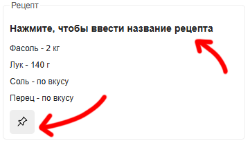
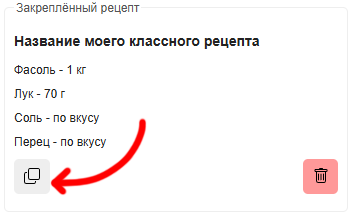
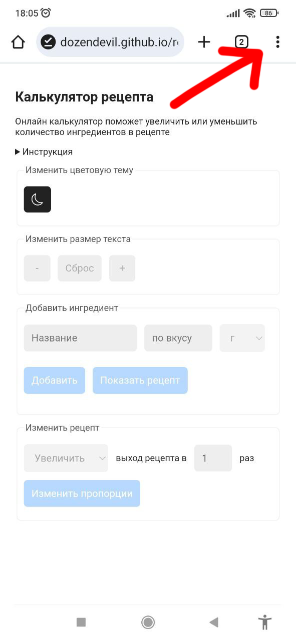
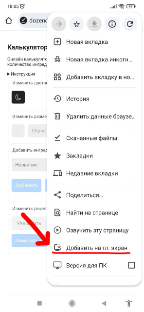
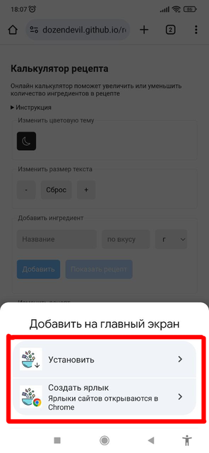

# Увеличить или уменьшить ингредиенты в рецепте

Онлайн калькулятор поможет увеличить или уменьшить количество ингредиентов в рецепте.

## Как работает приложение?

1. Заполняем название, количество и единицу измерения. Нажимаем на кнопку "Добавить". 

2. Выбираем "Увеличить" или "Уменьшить" выход рецепта, указываем во сколько раз. Нажимаем на кнопку "Изменить пропорции".

>Если менять пропорции не требуется, нажимаем на кнопку "Показать рецепт".

3. Вводим название рецепта и закрепляем его.

4. Копируем рецепт (или делаем снимок экрана).

## Как установить приложение на смартфон?

1. Открываем ссылку [https://dozendevil.github.io/recipe-calculator](https://dozendevil.github.io/recipe-calculator) в браузере.

2. Нажмаем на кнопку открыть меню (справа вверху, часто значок с 3-мя точками или линиями).

3. Выбираем пункт "Добавить на главный экран".

4. Нажмаем на кнопку установить или создать ярлык.

* при установке приложение будет открываться без адресной строки отдельно от браузера;
* созданный ярлык будет открывать ссылку в браузере.

4. Запускаем приложение с помощью значка.

